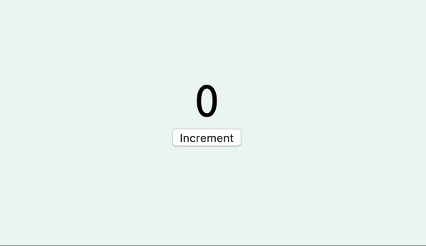

# Counter

Implement a component displaying a number which increments its value every time you click a button.

  

Implement an effect to show an alert when you get to 10.
Implement a coeffect to show the current time.
Show the time in Tokyo using the api `http://worldtimeapi.org/api/timezone/Asia/Tokyo`
