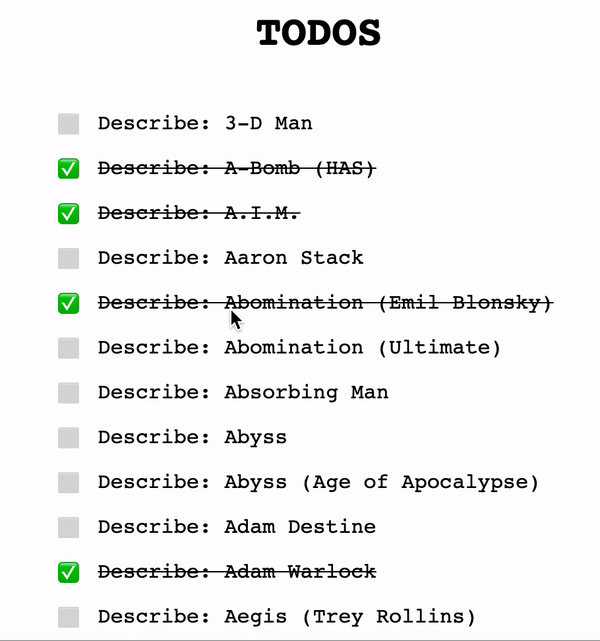
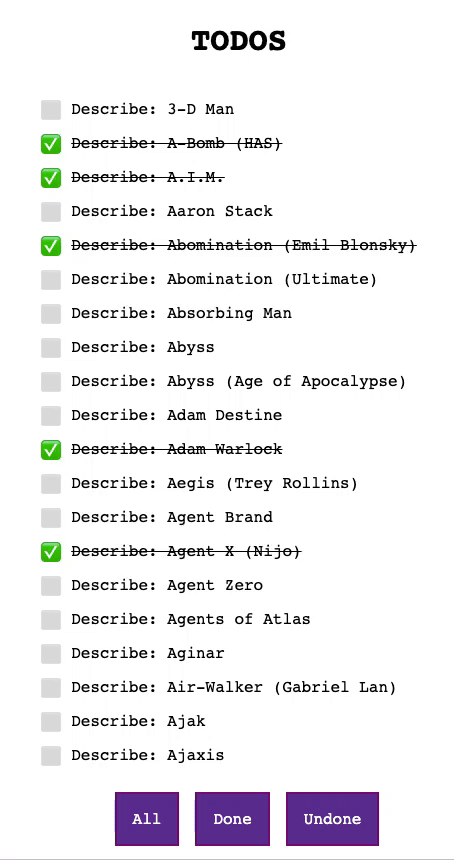

# Todos App

## First part: Events, effects and coeffects

You are given a simple implementation of the UI for a Todos application.

This application will show a list of Marvel characters (from this url `https://gateway.marvel.com/v1/public/characters?ts=thesoer&apikey=001ac6c73378bbfff488a36141458af2&hash=72e5ed53d1398abb831c3ceec263f18b`), marking as "done" the ones with a description.

Once loaded, you can check/uncheck every character in the list.

Implement the events you need in order to display the list and check/uncheck the elements.

  

## Second part: Selectors

Starting from the previous code, give the user the possibility to filter the Todos by its state: show all, show undone and show done.

  

