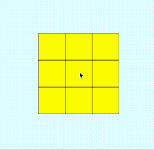

# The Lights Out Kata

Lights Out is a simple puzzle.  In this version of the puzzle, there is a 3x3 grid.

The elements of the grid can change state from `on` to `off` and from `off` to `on`.

Whenever you click on an alement, that element and the ones above, below, right and left of it change state.

  

The object of the game is to set all the elements to off.

## Source:

- https://github.com/xpmatteo/lights-out-kata